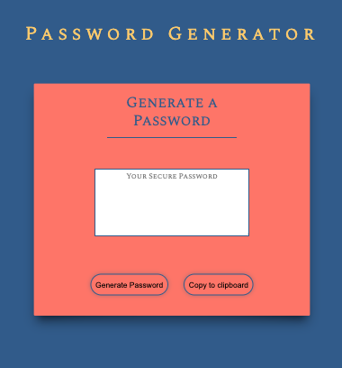

# Password-Generator
Creating an application that generates a random password based on user-selected criteria. This app will run in the browser and feature dynamically updated HTML and CSS powered by JavaScript.

## Built With

* HTML
* CSS
* BootStrap
* JavaScript

## Contributing

* Template and guidlines provided by Vanderbilt/Trilogy Bootcamp.

## Authors

* **Stephen Webb** - *Initial work* - [password-generator](https://stevie2codes.github.io/password-generator/)

## What I learned

In this project Ive implemented some basics of JavaScript.
* Functions
* Conditional Statements
* Loops
* Generating random values

I've understood the concepts of how these control flow statements work but, to put them into practice to build a program was a new challenge. Ive learned placing variables in the proper scope is very important. Having a basic pseudo layout of ideas and execution was also valuable in keeping this project well structured. Finding bugs in my program was a great learning experience for getting a deeper understanding of how these concepts all work together. 

